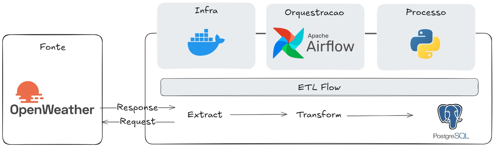

# 🌤️ Weather Pipeline — ETL Maringá

Pipeline de dados automatizado que coleta dados meteorológicos da cidade de **Maringá/PR** em tempo real via API do OpenWeatherMap, transforma os dados e os armazena em um banco de dados PostgreSQL — orquestrado com **Apache Airflow**.

---

## 🏗️ Arquitetura



O pipeline é executado **a cada hora** via Apache Airflow.

---

## 📁 Estrutura do Projeto

```text
weatherETL/
├── config/
│   └── .env                  # Variáveis de ambiente (não versionado)
├── dags/
│   └── weather_dag.py        # Definição do DAG no Airflow
├── src/
│   ├── extract.py            # Extração dos dados da API
│   ├── transform.py          # Transformações e limpeza dos dados
│   └── load_data.py          # Carga dos dados no PostgreSQL
├── data/
│   └── weather_data.json     # Arquivo intermediário gerado na extração
├── .env.example              # Modelo do arquivo de variáveis de ambiente
└── README.md
```

---

## ⚙️ Tecnologias Utilizadas

| Tecnologia | Uso |
| --- | --- |
| Python 3.14 | Linguagem principal |
| Apache Airflow | Orquestração do pipeline |
| Pandas | Transformação e manipulação dos dados |
| SQLAlchemy + psycopg2 | Conexão e carga no PostgreSQL |
| PostgreSQL | Banco de dados de destino |
| Docker | Ambiente de execução do Airflow |
| OpenWeatherMap API | Fonte dos dados meteorológicos |

---

## 🚀 Como Executar

### Pré-requisitos

- Docker e Docker Compose instalados
- Conta na [OpenWeatherMap](https://openweathermap.org/api) para obter a API Key
- PostgreSQL rodando localmente ou acessível via rede

### 1. Clone o repositório

```bash
git clone https://github.com/seu-usuario/weather-pipeline.git
cd weather-pipeline
```

### 2. Configure as variáveis de ambiente

Crie o arquivo `config/.env` com base no exemplo:

```bash
cp .env.example config/.env
```

Preencha as variáveis:

```env
API_KEY=sua_chave_openweathermap
DB=nome_do_banco
DB_USER=seu_usuario
PASSWORD=sua_senha
```

### 3. Suba o ambiente com Docker

```bash
docker-compose up -d
```

### 4. Acesse o Airflow

Abra o navegador em `http://localhost:8080` e ative o DAG `weather_pipeline`.

---

## 🔄 Detalhes do Pipeline

### `extract.py`

- Realiza requisição `GET` na API do OpenWeatherMap para Maringá/PR
- Salva a resposta bruta em `data/weather_data.json`
- Retorna os dados para a próxima etapa

### `transform.py`

- Carrega o JSON e cria um DataFrame com `pd.json_normalize`
- Normaliza a coluna aninhada `weather`
- Remove colunas desnecessárias
- Renomeia colunas para nomes padronizados em português
- Converte timestamps Unix para datetime no fuso `America/Sao_Paulo`

### `load_data.py`

- Conecta ao PostgreSQL via SQLAlchemy
- Insere os dados na tabela `mga_weather`
- Realiza uma consulta de verificação após a carga

---

## 📋 Variáveis de Ambiente

| Variável | Descrição |
| --- | --- |
| `API_KEY` | Chave de acesso à OpenWeatherMap API |
| `DB` | Nome do banco de dados PostgreSQL |
| `DB_USER` | Usuário do banco de dados |
| `PASSWORD` | Senha do banco de dados |

---

## 📄 Licença

Este projeto está sob a licença MIT. Consulte o arquivo `LICENSE` para mais detalhes.
